# 香城模擬器 (The City of Heung Shing) v4.9.0 — 【香城夜色】

香城模擬器 (The City of Heung Shing) v4.9.0 — 【香城夜色】 is a SimCity 2000-style city builder inspired by Hong Kong: isometric pixel-art buildings, a real day/night cycle with per-building lighting, Hong Kong weather and typhoon signals, a Legislative Council, a player-run bus company, a container port and an airport, a local SQLite save system and a classic windowed UI. Free, no in-app purchases.

Website and downloads: https://nortonyuen-oss.github.io/heung_shing_simulator/

Questions, bug reports and comments: [Player message board](https://nortonyuen-oss.github.io/heung_shing_simulator/feedback.html).
Read public posts and replies on the website; sign in to GitHub to confirm a new
post or reply. Website messages are tracked with the `website-feedback` issue label.

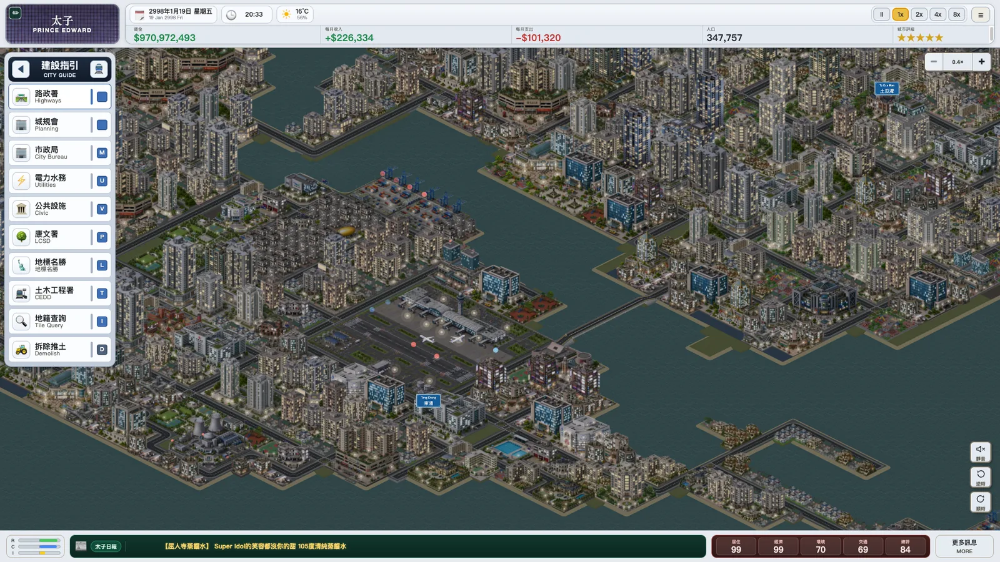

## What the game is

**Build.** Zone residential, commercial and industrial land, lay roads and bridges, place parks, schools, hospitals, police and fire stations and power plants. Buildings grow, upgrade and redevelop on their own with demand and land value; every model is original pixel art, and 133 of them ship pre-baked night textures.

**Run it.** Open a container port and cargo vessels sail in from open water, berth parallel to the quay and exchange cargo. Approve the airport and aircraft land along curved approaches and taxi to their gates. Found the Heung Shing Bus Company: build a depot, open routes, buy buses, and follow any of them with a live tracking camera.

**Govern.** Ten officials sit in the council; special resolutions are priced in months of city income and each member takes a stance. What passes really happens - a football exhibition match, a drone light show every three months - and it all ends up in the Heung Shing Forum and the newspapers, with optional cloud AI headlines if you connect your own key.

**Live through the day.** One displayed day is one game month: sunrise and sunset, weather, rainstorm warnings, typhoon signals, council bills and bus timetables all run on the same clock. After sunset the street lamps come on together and the windows fill in building by building; after 23:00 the towers wind down until half of them show nothing but street lamps, while hospitals and police stations stay lit until dawn.

| | |
|---|---|
| 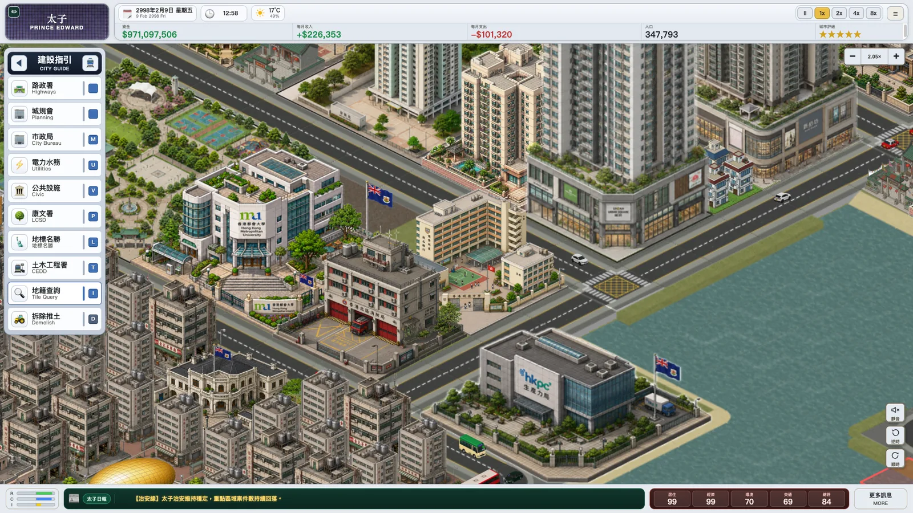 A city that feels like Hong Kong: from public housing to glass towers, with minibuses and taxis driving on the left. | 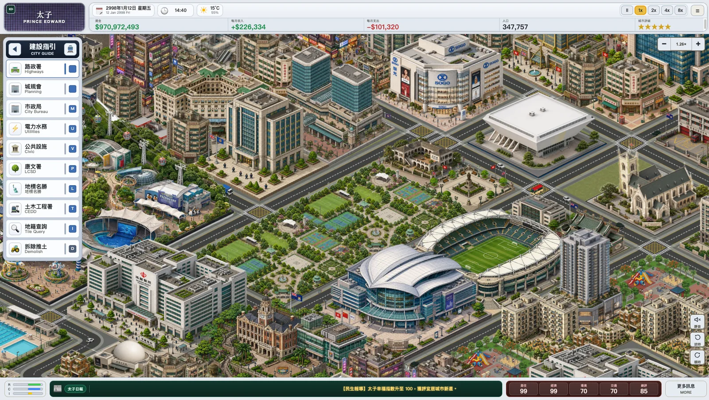 Landmarks and leisure facilities unlock one by one as the city grows. |
| 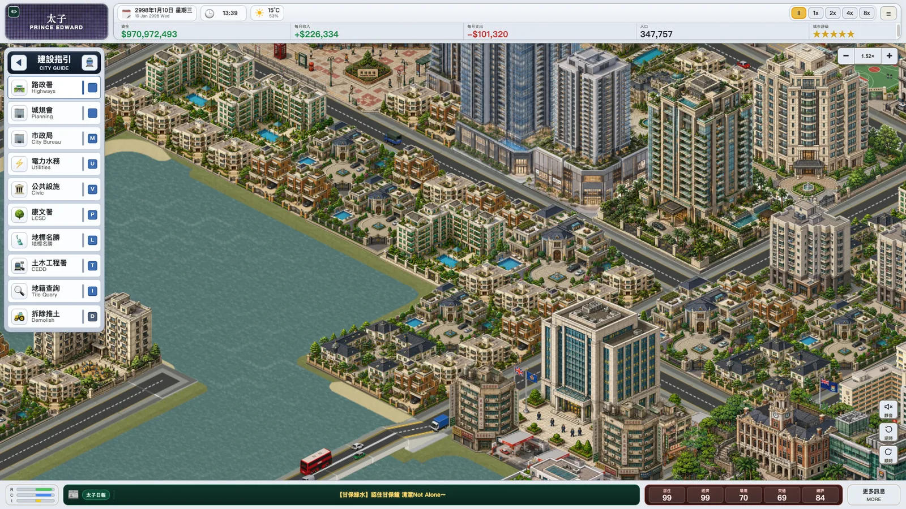 Waterfront living: you set the zoning density, buildings upgrade themselves. | 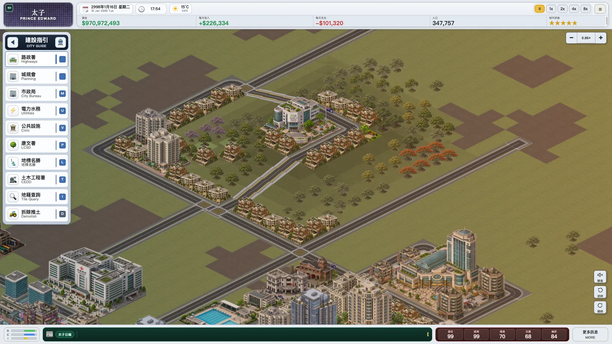 Custom terrain - hills, slopes and woods are part of the map. |
| 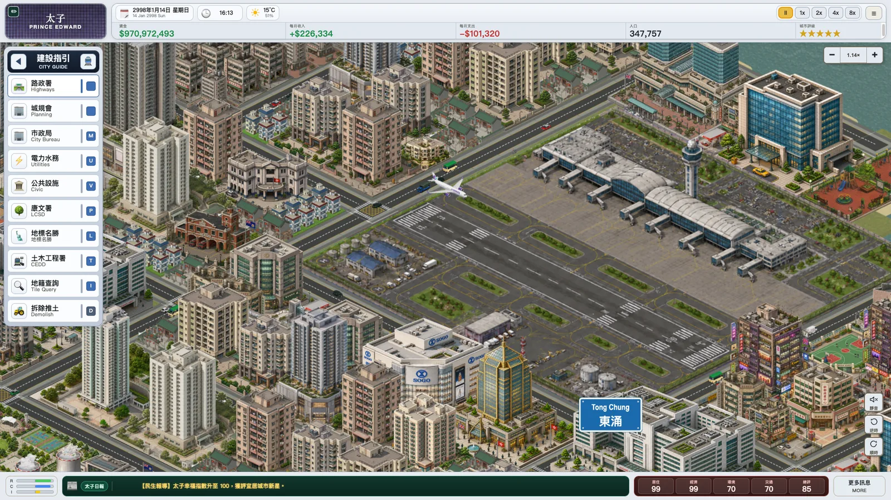 The airport in operation, beside a bilingual district sign you named yourself. | 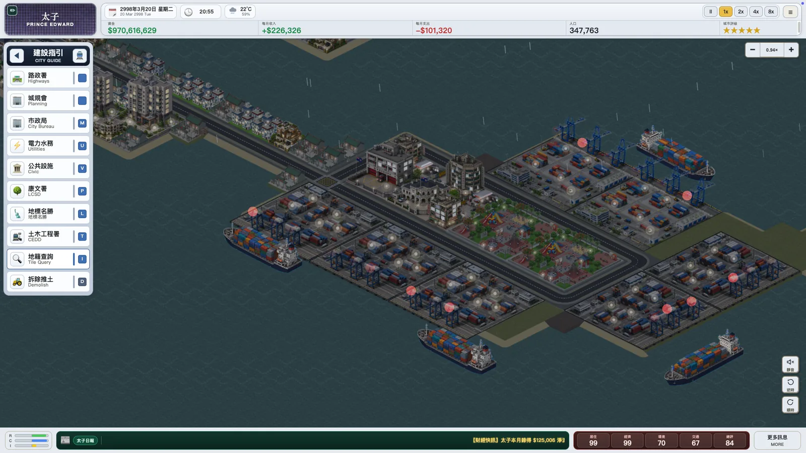 The container port works through the night. |
| 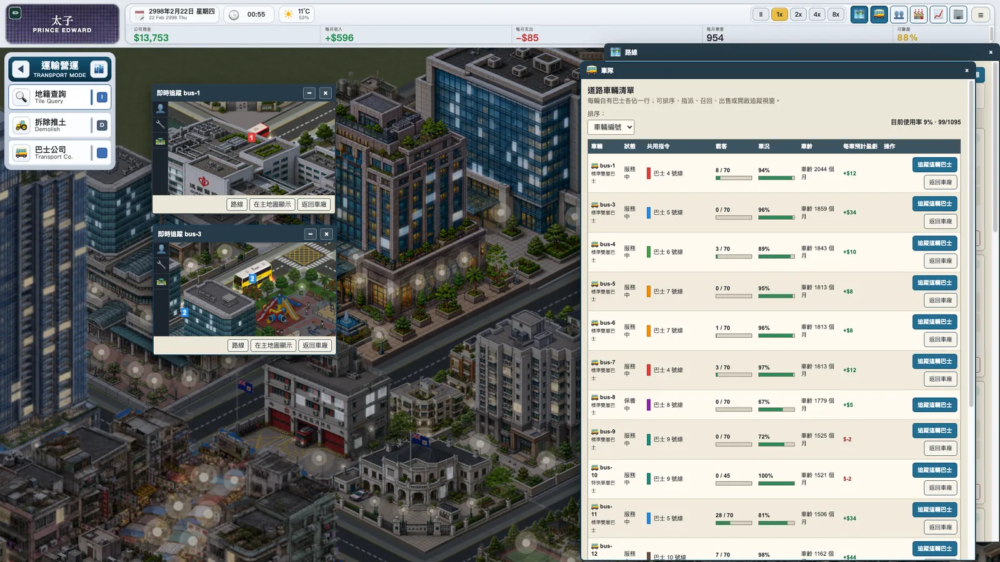 Run your own bus company with per-vehicle load factors, takings and tracking cameras. | 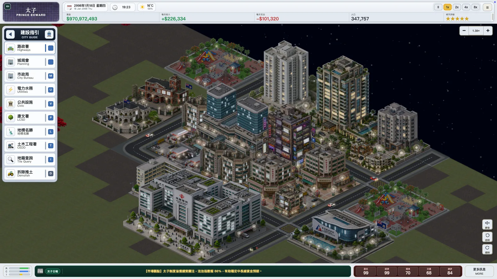 Night begins with the street lamps, then the windows come on one building at a time. |
| 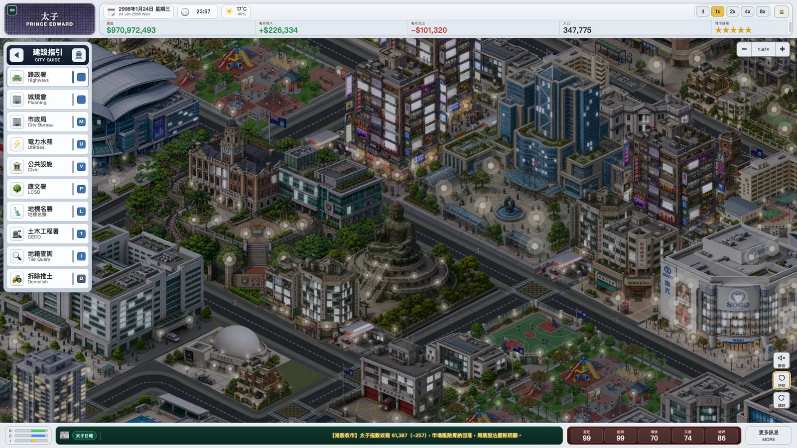 Landmarks stay fully lit until one in the morning. | 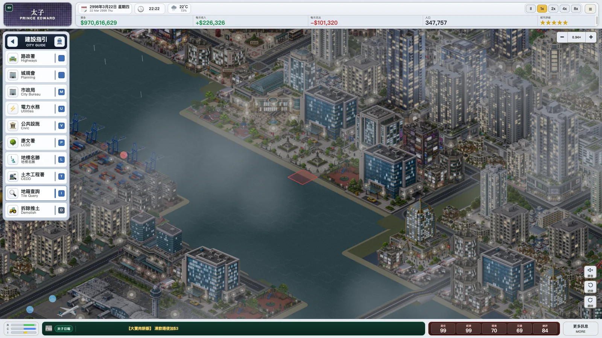 Weather on the sky clock: rain, mist, warnings and typhoon signals step up and down. |
| 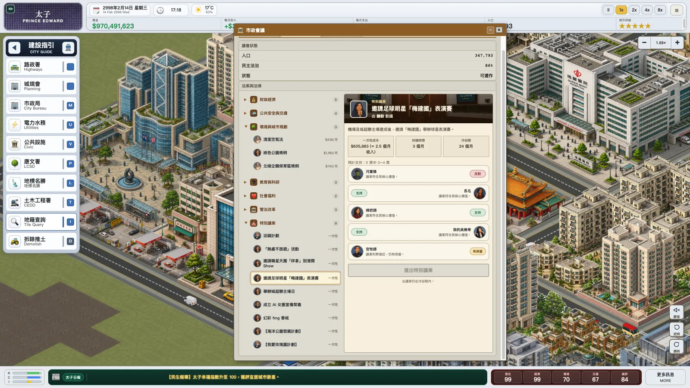 A council, not just a menu: resolutions priced in months of income. | 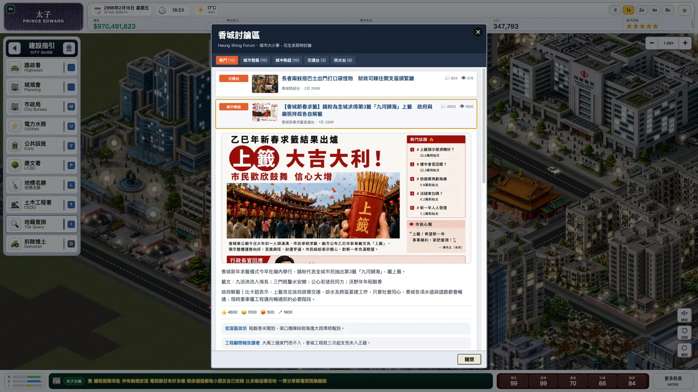 The Heung Shing Forum discusses everything, with illustrated newspaper pages. |
| 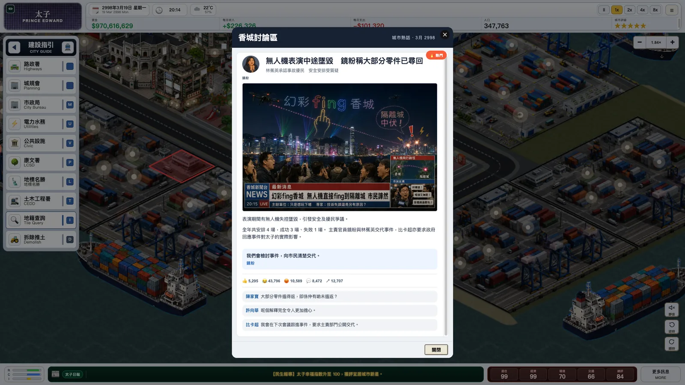 What the council passes really happens - and makes the news when it goes wrong. | 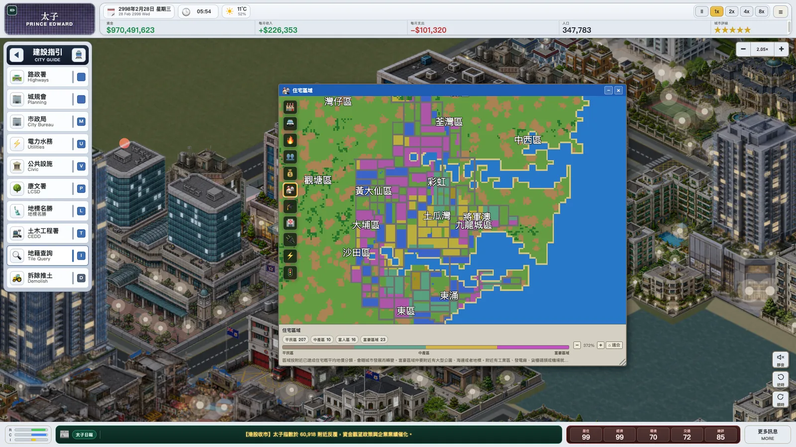 Overlays and the districts you named, on one minimap. |

More screenshots: `docs/assets/gameplay/` (the same set the website gallery uses).

## Features

- Zone residential, commercial and industrial districts at three densities; buildings grow, upgrade and redevelop with demand and land value.
- Build roads and bridges, parks, schools, hospitals, police and fire stations, power plants, temples, churches and a growing list of landmarks (Ocean Park, the stadium, the coliseum, Murray House, the Big Buddha, the Space Museum and more).
- A real day/night cycle: one displayed day is one game month with real month lengths and leap years. Every calibrated model ships four baked night textures (peak, half-lit, deep night, street lamps only); each building picks its own from its tile seed, so the city lights up at dusk and dims after midnight block by block, while emergency services stay lit all night.
- Hong Kong weather on the same clock: conditions hold for hours, rainstorm warnings step amber/red/black with hysteresis, and typhoons arrive every few displayed days in season, climbing from Signal 1 to 10 and back over a day to a day and a half.
- A Legislative Council with ten officials: special resolutions priced in months of city income, real effects when passed, and follow-up news.
- The Heung Shing Bus Company (transport expansion): depots, routes, fleet purchases, maintenance and breakdowns on displayed time, per-vehicle load factors and takings, and live tracking cameras.
- Container ports with cargo vessels that sail in from open water, berth parallel to the quay, exchange cargo and sound their horn; Rose Garden International Airport with aircraft landing along curved approaches and taxiing to their gates.
- A weather-aware ice cream van that pulls up beside schools and attractions by day, plays its melody and merges back into traffic.
- Bilingual Hong Kong-style district signs; each sign defines a local news area whose traffic, education, health, pollution, land value and population feed headlines. Rename districts and the city itself any time.
- The Heung Shing Forum, illustrated newspapers, district news tickers, an annual temple fortune draw, a stock exchange tied to the economy, and optional cloud AI headlines (bring your own Ollama key).
- Classic overlays for pollution, crime, fire risk, population, land value, electricity and power plants; a minimap; map rotation; the viewpoint, zoom and rotation saved with every city.
- Budget, taxes, loans, department funding and city policies; a local SQLite save system with autosave.

## Electricity System

- Different building types consume different amounts of electricity.
- Different power plants have different output, upkeep, pollution, fire risk, and usable lifespan.
- Old plants gradually lose output and eventually become abandoned.
- Power shortages slow growth and can stop city expansion.
- The electricity overlay shows city power status and load.


## Requirements

- Node.js 22 LTS

## Run

```bash
npm install
npm start
```

Open http://localhost:3000/ in your browser.

## Desktop Development

### Optional AI news

AI headlines are optional and use Ollama Cloud with `gpt-oss:20b` preferred.
Local model execution is disabled so the game cannot consume player CPU or
memory. All simulation and rule-based news continue to work without a cloud
account, and models are not bundled into the Windows or macOS installers.

No API key is included in this repository, GitHub Actions, or any installer.
After installing the game, each player opens **Settings → AI News**, pastes
their own Ollama API key once, chooses an available model, and enables AI
headlines.

Packaged builds encrypt the Ollama Cloud API key and AI choices with Electron
`safeStorage` (macOS Keychain or Windows DPAPI). Browser development stores the
same settings in an AES-256-GCM encrypted file under `.data/`, protected by a
separate owner-only key file. The provider uses Node's built-in `fetch`, so it
adds no native dependency or platform-specific path to the `.exe` or `.dmg`
build.

The browser development flow stays the same. To test the installable desktop version locally:

```bash
npm run electron:dev
```

Desktop saves are stored in the operating system user data folder instead of the project `.data` folder.

## Desktop Updates

Installed Windows desktop builds check the latest GitHub Release after launch and can download NSIS updates in the background. When an update is ready, the app asks the player to restart and install it.

macOS builds currently show a download-page prompt instead of installing automatically because true macOS auto-update requires a signed app.

## Build Installers

macOS:

```bash
npm run dist:mac
```

Windows:

```bash
npm run dist:win
```

The installers are written to `release/`. Build Windows installers on Windows, or use the included GitHub Actions workflow.

For Windows auto-update, the GitHub Release must include the public NSIS setup file, `latest.yml`, and the matching setup `.blockmap`. The workflow patches `latest.yml` so the updater uses the same no-spaces setup filename shown on the website.

## Release Flow

Use semantic versions in `package.json`:

- `2.0.1` for bug fixes
- `2.1.0` for gameplay/content updates
- `3.0.0` for breaking save-format changes

Every release also has a theme name in `package.json` under `releaseTheme`. Use
the same name in the release notes, game About dialog and download website.

To trigger CI installer builds:

```bash
git tag v2.0.0
git push origin v2.0.0
```

## Download Website

The static download site lives in `docs/` and is designed for GitHub Pages. It links to the latest GitHub Release assets:

- `The.City.of.Heung.Shing-2.0.0-arm64.dmg`
- `The.City.of.Heung.Shing-2.0.0-x64.dmg`
- `The.City.of.Heung.Shing.Setup.2.0.0.exe`
- `The.City.of.Heung.Shing.2.0.0.exe`

To publish a new version:

1. Build the installers.
2. Create a GitHub Release for the matching tag.
3. Upload the installer files from `release/`.
4. Push `docs/` to `main`; the `Deploy Website` workflow publishes the site.

## Asset Optimization

`Models/` PNG files are the editable source of truth. Do not maintain a second
set of WebP models by hand. Every desktop build now prepares a content-addressed
release stage automatically as lossless WebP with a maximum source dimension of
1024px:

```bash
npm run prepare:release-assets
npm run verify:release-assets
```

The ignored output is written to `.data/package-assets/Models`. Packaging does
not run defringe or reinterpret antialiased edge colours: the checked-in PNG is
the visual master. Buildings have empty transparent canvas edges removed, while
trees retain their original canvas. Every result is then transparently padded
at the top and sides to the nearest power-of-two dimensions, bottom-centred, so
Phaser 3.60 can generate mipmaps when large source art is minified in-game.
`model-assets.json` preserves each logical PNG identity, maps it to the packaged
WebP, and records its content hash, trim, padding, mipmap eligibility and anchor
geometry. Deleted or replaced source files are reflected automatically on the
next build.

Electron packages exclude source `Models/**` and include only this staged WebP
tree and manifest. `npm run dist`, `npm run dist:mac`, and `npm run dist:win` all
run preparation and verification first. The current 145-model set is reduced
from 151.0 MiB to 95.5 MiB while keeping every visible RGBA pixel bit-exact and
all 145 packaged textures mipmap-safe.

Optional release-pipeline environment variables:

- `ASSET_MAX_DIMENSION` (default `1024`)

Example:

```bash
ASSET_MAX_DIMENSION=1024 npm run prepare:release-assets
npm run verify:release-assets
```

Defringe remains a separate authoring diagnostic and is never applied during
release packaging. To inspect a new PNG without changing the source model, run
a dry scan. Supplying an output directory writes mirrored preview PNGs:

```bash
npm run defringe:assets
npm run defringe:assets -- --match residential3 --output-dir .data/defringed
```

## Controls

- Use the left tool palette to place roads, zones, infrastructure, and power plants.
- Use the overlay buttons to switch map views.
- Use the rotate controls to change the map orientation.
- Click tiles or buildings to inspect details.

## Notes

- The game uses a local SQLite-backed save server.
- Map overlays, plant aging, and power shortages are part of the current gameplay loop.

## License and copyright

Copyright © 2026 nortonyuen-oss, for the portions the developer owns or may license.
The game is proprietary: free play, personal backups and specified sharing are
permitted by [LICENSE](LICENSE). The public source code is not an open-source
license grant. Repackaging, redistribution, derivative releases and asset reuse
require separate permission unless applicable law or a third-party license allows them.

Screenshots, guides and gameplay videos are welcome under the license, including
monetized commentary for content the developer can license. Third-party music and
other restricted content are excluded: the existing Suno free-plan tracks are not
cleared here for monetized videos or streams. Existing valid permissions for older
versions remain unaffected.

See the [copyright page](https://nortonyuen-oss.github.io/heung_shing_simulator/copyright.html),
[third-party notices](THIRD_PARTY_NOTICES.md) and [source inventory](docs/licensing/README.md).
